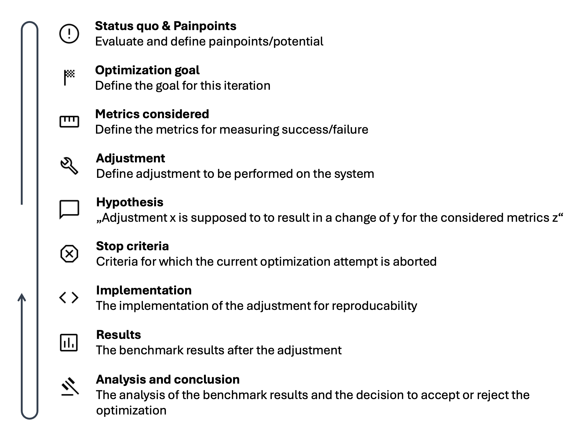

# RAG Optimization Framework

A framework consisting of a lightweight Retrieval-Augmented Generation (RAG) system and a flexible benchmark infrastructure for systematic, use-case-specific optimization of RAG systems for individual knowledge management scenarios.

---

**This code supplements my master's thesis, titled:**

:de: "Intelligentes Wissensmamagement in KMU: Konzeption und Evaluation eines lokalen, RAG-basierten Wissensmanagementsystems"

:uk: "Intelligent Knowledge Management in SMEs: Design and Evaluation of a Local, RAG-Based Knowledge Management System"

:bulb: Abstract
> Small and medium-sized enterprises (SMEs) engaged in custom development accumulate substantial domain-specific knowledge that is frequently distributed across heterogeneous internal systems, limiting its accessibility and interpretability. Retrieval-Augmented Generation (RAG) presents a viable approach to address this challenge by enabling structured retrieval of fragmented information and facilitating interactive knowledge exploration. This thesis investigates the critical performance factors of RAG systems designed for knowledge management in resource-constrained SME environments with strict data sovereignty requirements, and proposes methods for their systematic quantification and optimization. A modular framework comprising a baseline RAG system and a flexible benchmarking infrastructure was developed to support use-case-specific, differentiated evaluation. An empirical optimization study conducted within this framework demonstrated statistically significant overall performance gains, with notable improvements in trustworthiness, response groundedness and context precision. The findings confirm that RAG systems can deliver immediate utility under simple configurations using publicly available components, while also establishing that no universally optimal configuration exists; optimization strategies must be evaluated contextually, as their efficacy is not transferable across arbitrary application scenarios or knowledge bases.

#### What this repository contains:
- the RAG module in it's final configuration after the optimization study in `/rag`
- the customizable benchmark infrastructure in `/benchmark`
- the notebooks for the evaluation of the benchmark results in `/eval`

#### What this repository does not contain:
- the raw benchmark results of from the thesis (due to them containing internal company data)

---

### How to use the Framework:

:wrench: **Configuration**
 1. Choose and install language and embedding models locally (see [Ollama Docs](https://docs.ollama.com/) for that)
 2. Install required packages (see `requirements.txt` for `rag`/`benchmark`/`eval`)
    - Note: for benchmarking the RAG module, install both `rag/requirements.txt` and `benchmark/requirements.txt`
 3. Prepare Q&A samples for evaluation (use [cleaned data preparation scripts from thesis](./benchmark/data_preparation/) or define manually)
 4. Define a config file for the RAG module (see [example](./rag/config.example.json))
    - Note: the sources from the example are supported from the Loader defined in the thesis (see [`loader.py`](./rag/loader.py)). You can add arbitrary data sources as long as you define your own implementation of the  [`base_loader`](./rag/interfaces/base_loader.py) interface to handle them.
  5. Configure benchmark: specify the path to your config and to your Q&A samples in the `CONFIG` dict of the [benchmark pipeline](./benchmark/pipeline.py)
  6. Customize metrics: Add or remove metrics in the [`metrics_provider`](./benchmark/metrics_provider.py). Use metrics from [Ragas](https://docs.ragas.io/en/stable/concepts/metrics/available_metrics/) or define your own (see [custom metrics](./benchmark/custom_metrics) for custom Judge-LLMs)

:test_tube: **Start benchmark**

Execute the [`pipeline.py`](./benchmark/pipeline.py) to start the benchmark
- Note: the benchmark initializes the RAG module under test. When this is initialized and cannot find an index in the specified directory (see [config](./rag/config.example.json)) it creates one automatically.
- Note: when finished it stores the benchmark results as a JSON file in the specified `OUTPUT_DIR` (see `CONFIG` dict of the [benchmark pipeline](./benchmark/pipeline.py))

:microscope: **Evaluate results**

See [`/eval/base`](./eval/base/) for basic analysis and comparison. Extend for custom analysis. Check [`eval/optimization`](./eval/optimization/) for inspiration on deeper analysis from the thesis. 

:rocket: **Optimize & Create!**

This allows you to optimize and evaluate the RAG module iteratively. After you finished optimizing, you can integrate the RAG module to the desired target environment (e.g. backend of a Web Application, as an agent in your Multi-Agent-Environment, ...)

I recommend using the following scheme for the iterative optimization:

